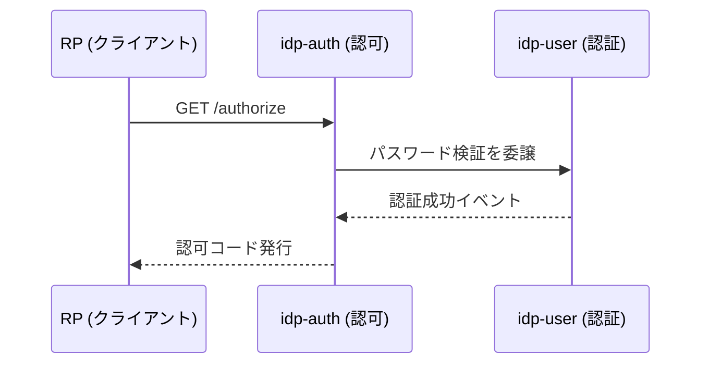
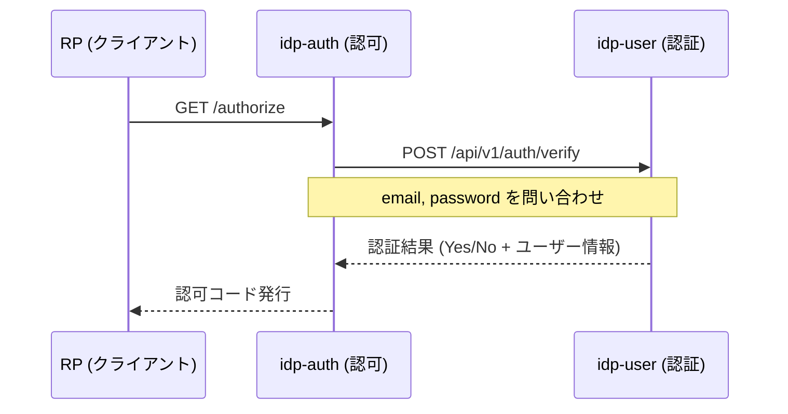
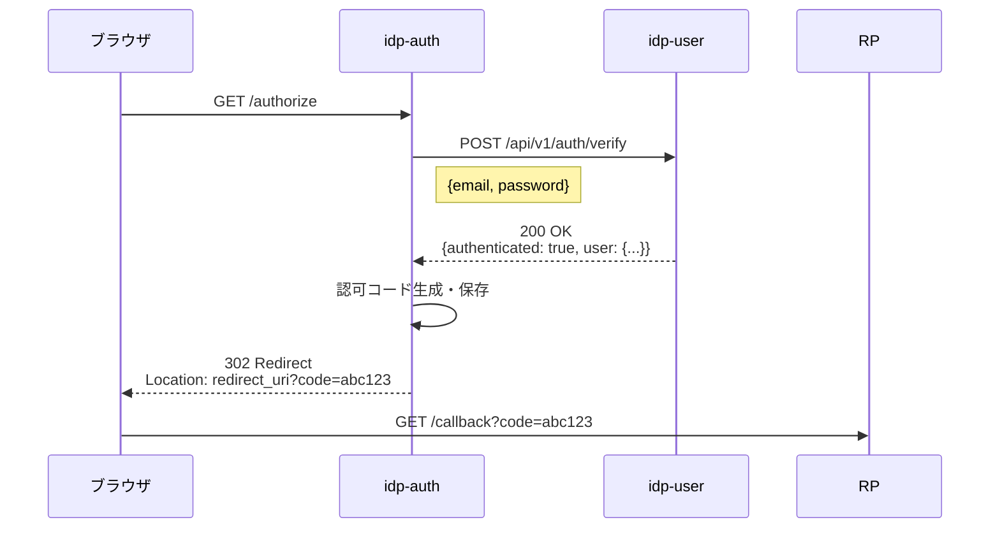
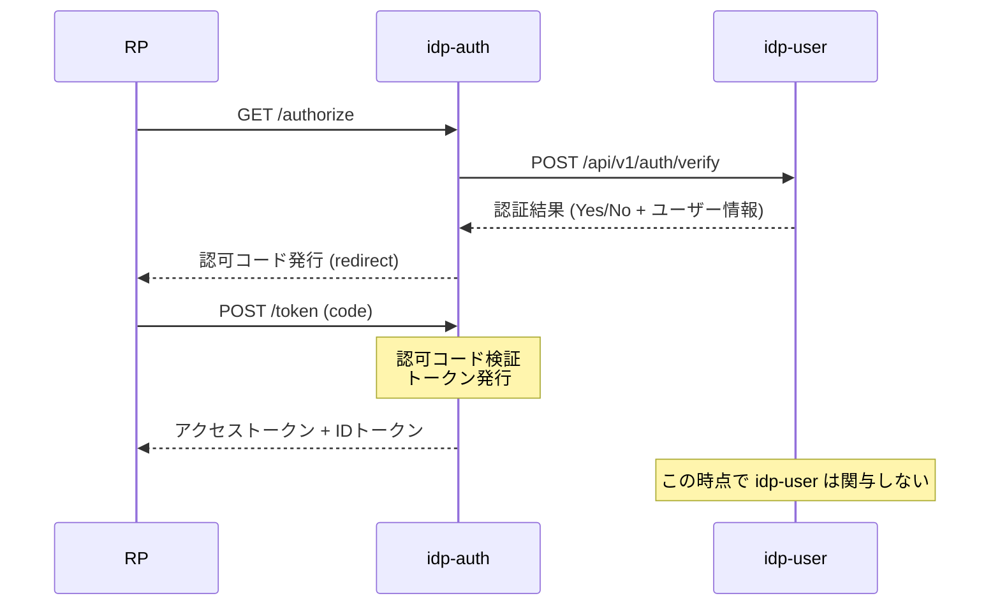
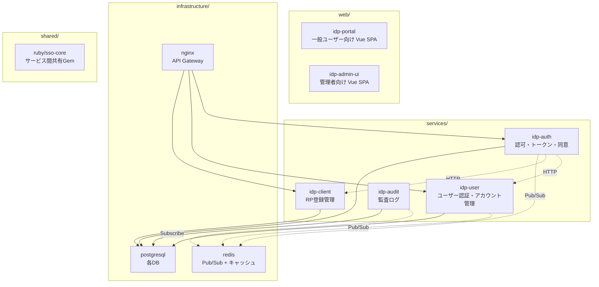

# SSO ドメイン境界設計書

本ドキュメントは、プロジェクト固有のコンテキストに基づき、SSOシステムのドメイン境界をどこに引くかを定めた設計書です。

---

## 1. プロジェクトコンテキスト

| 項目 | 回答 |
|---|---|
| **システム構成** | マイクロサービス |
| **ユーザー規模** | 個人開発レベル |
| **連携アプリ数（RP）** | 2〜3個（拡張可能） |
| **プロトコル** | OAuth 2.0 / OpenID Connect |
| **管理画面** | SPA（Vue 3 + API） |
| **非同期連携** | イベント駆動（Redis Pub/Sub等）を学習目的で導入 |

---

## 2. ドメイン定義

本プロジェクトでは、以下の5ドメインを定義します。

| ドメイン | 責務 | 担当サービス |
|---|---|---|
| **認可（Authorization）** | トークンの発行・検証・失効 | `idp-auth` |
| **ユーザー（User/Identity）** | アカウントと認証 | `idp-user` |
| **クライアント（Client/RP）** | 連携アプリの管理 | `idp-client` |
| **同意（Consent）** | ユーザー同意的管理 | `idp-auth` 内（※注） |
| **監査（Audit）** | 操作履歴 | `idp-audit`（イベント購読） |

> **※注**：同意ドメインは、個人開発レベル・RP数2〜3個という規模では、認可サービス内に閉じておく。RP数が増えたり、同意履歴の複雑な管理が必要になった場合に独立サービス化を検討する。

---

## 2.5 各サービスの責務とデータ（具体例）

各サービスの詳細な責務、持つデータ、API仕様、HTTP通信例については [01-prerequisites-idp-auth-and-user.md](./01-prerequisites-idp-auth-and-user.md) を参照。

### 簡単な比較

| 観点 | `idp-user` | `idp-auth` |
|---|---|---|
| **対象** | エンドユーザー（人） | クライアントアプリ（RP） |
| **持つ秘密** | パスワードハッシュ | client_secret、JWT署名鍵 |
| **RPが直接使う？** | いいえ（内部サービス） | はい（OAuthエンドポイント） |
| **認証 vs 認可** | **認証**（Authentication）= 本人確認 | **認可**（Authorization）= 権限委譲 |

---

## 3. 境界設計の核心：ログイン処理

### 3.1 背景

「ログイン処理」では、ユーザー認証（パスワード照合）と認可コード発行が絡み合います。ここが最も境界の引き方に迷うポイントです。

### 3.2 検討案

#### 案A：厳密に分離（純粋分離）

- **メリット**：ドメインの純粋性が保たれる。認証と認可の責務が明確。
- **デメリット**：分散トランザクションの設計が必要。個人開発ではオーバーヘッドが大きい。

#### 案B：実用的に緩める（推奨：本プロジェクト）

**具体的な流れ**：

1. `idp-auth` の `/authorize` エンドポイントが、ブラウザからのリクエストを受ける
2. `idp-auth` は「このユーザーは本物か？」を知る必要があるので、`idp-user` の認証APIを内部的に呼び出す
3. `idp-user` がパスワードを検証し、「OK、この人は本物です」と返す
4. `idp-auth` はその返答を受けて、認可コード（Authorization Code）を生成・保存する
5. ブラウザを RP の `redirect_uri` に戻す（`?code=xxx` を付けて）

- **メリット**：実装がシンプル。個人開発・学習に最適。
- **デメリット**：認可サービスが認証の一部知識を持つ（やや密結合）。

### 3.3 本プロジェクトの選定：案B（実用的緩和）

**判断根拠**：

1. **個人開発レベル**：分散トランザクションの設計・デバッグ工数を避ける。
2. **RP数が少ない**（2〜3個）：認可コード発行の頻度・複雑さが低い。
3. **学習の段階的進化**：まず案Bで動作を確認し、将来的に案Aへの移行を検討する余地を残す。
4. **イベント駆動の併用**：監査ログは非同期で分離するため、ドメイン分離の学習価値は `idp-audit` で補える。

**ただし、以下の原則を守る**：

- `idp-auth` は `idp-user` の内部実装（パスワードハッシュ形式等）を知らない。
- `idp-user` は「認証API」を提供し、Yes/No + ユーザー基本情報を返すだけのブラックボックスとする。
- パスワード検証ロジックは `idp-user` 内に完全に閉じる。

---

## 3.4 フロー概要

認可コードフローにおける `idp-auth` と `idp-user` の連携概要は以下の通り。

各処理の担当分担：

| 処理 | 担当 | 理由 |
|---|---|---|
| パスワード検証 | `idp-user` | パスワード情報の管理責任 |
| 認可コード発行 | `idp-auth` | OAuthプロトコルの責任範囲 |
| アクセストークン発行 | `idp-auth` | トークン lifecycle の責任範囲 |
| セッションCookie発行 | `idp-auth` | ブラウザとのやり取りを担当 |

詳細な HTTP リクエスト/レスポンス例は [01-prerequisites-idp-auth-and-user.md](./01-prerequisites-idp-auth-and-user.md) を参照。

---

## 4. 推奨サービス構成

---

## 5. サービス間連携パターン

### 5.1 同期通信（REST API）

| 呼び出し元 | 呼び出し先 | 用途 |
|---|---|---|
| `idp-auth` | `idp-user` | ユーザー認証問い合わせ |
| `idp-auth` | `idp-client` | client_id / client_secret 検証 |
| `idp-portal` | `idp-auth` | 認可エンドポイント呼び出し |
| `idp-admin-ui` | `idp-auth` | トークン発行状況確認 |

### 5.2 非同期通信（Redis Pub/Sub）

| 発行サービス | イベント名 | 購読サービス | 用途 |
|---|---|---|---|
| `idp-auth` | `token.issued` | `idp-audit` | トークン発行ログ記録 |
| `idp-auth` | `token.revoked` | `idp-audit` | トークン失効ログ記録 |
| `idp-user` | `user.login` | `idp-audit` | ログイン履歴記録 |
| `idp-user` | `user.created` | `idp-audit` | ユーザー登録ログ記録 |

> **なぜ監査だけ非同期か？**：監査は「必ず記録したい」が「即時反映は不要」という特性。非同期にすることで、認可フローのレイテンシを増やさず、耐障害性を高められる。

---

## 6. 段階的実装計画（フェーズ対応）

| フェーズ | 実装内容 | ドメイン境界の進化 |
|---|---|---|
| **Phase 1** | DB設計・ユーザー登録・ログイン | `idp-auth` + `idp-user` + `idp-client` を同一Railsアプリ内でモジュール分割 |
| **Phase 2** | OAuth2/OIDCエンドポイント（/authorize, /token） | `idp-auth` を切り出し。`idp-user` との認証APIをHTTP化 |
| **Phase 3** | JWT発行・検証、/userinfo | `idp-auth` 内のトークン責務を確立。JWKSエンドポイント追加 |
| **Phase 4** | デモRPアプリ（Vue SPA） | `idp-portal` を実装。`idp-auth` の同意画面と連携 |
| **Phase 5** | PKCE対応・セキュリティ強化・監査ログ | `idp-audit` を新設。Redis Pub/Subでイベント連携を導入 |

---

## 7. トレードオフまとめ

| 分割粒度 | 独立性 | 複雑さ | 向いている状況 |
|---|---|---|---|
| **認可・ユーザー・クライアントを完全分離** | 最高 | 高（分散TX必須） | チームが分かれ、大規模運用の場合 |
| **認可がユーザーを呼び出す（本設計）** | 中 | 中 | 個人開発・小規模。学習に最適 |
| **全て同一アプリ（モノリシック）** | 低 | 最低 | Phase 1のみ、または本番小規模 |

**本プロジェクトの結論**：

- **認可（`idp-auth`）** と **ユーザー（`idp-user`）** を分離する。
- ログイン処理は「認可がユーザーを呼び出す」緩やかな境界（案B）で開始。
- **監査（`idp-audit`）** はイベント駆動で完全に疎結合化し、ドメイン分離の学習価値を確保する。
- 将来、ユーザー規模・RP数が増えた際に、案A（厳密分離）への移行を検討する。

---

## 8. 関連ドキュメント

- [04-directory-structure-microservices.md](./04-directory-structure-microservices.md) — マイクロサービス構成の4案
- [05-microservices-tradeoffs.md](./05-microservices-tradeoffs.md) — 各切り分け方のメリット・デメリット
- [03-directory-structure-monolithic.md](./03-directory-structure-monolithic.md) — モノレポ構成案（Phase 1の参考）
- [requirements.md](../project/requirements.md) — プロジェクト要件定義
