# ハイブリッド構成パターン

実際のシステムでは、単一のアーキテクチャだけでなく複数を組み合わせることが多い。本章では、現場でよく見られる5つのハイブリッドパターンについて、構成・メリット・デメリット・適用シーンを具体化して説明する。

---

## 目次

| パターン | 概要 |
|---|---|
| **モジュラーモノリス + 一部マイクロサービス** | コアドメインはモジュラーモノリス、高負荷・特化処理だけを切り出し |
| **モノリス + イベントストリーミング** | 単一アプリだが、外部連携や集計はKafka等で非同期化 |
| **マイクロサービス + モジュラーモノリス（ストラングラーフィグ）** | レガシーモノリスを段階的にマイクロサービス化 |
| **BFF（Backend for Frontend）+ マイクロサービス** | クライアント毎にAPI集約層を設け、下位はgRPC/REST |
| **CQRS + イベントソーシング** | コマンドとクエリを分離、イベントストリームをソース・オブ・トゥルースに |
| **個人開発におけるSSOとモジュラーモノリス** | 個人開発でSSOをモジュラーモノリスで作る場合の判断基準と指針 |
| **大規模IDaaSでのハイブリッド構成** | Auth0/Okta/Keycloak等の実際の内部構成と現場での多いパターン |

---

## 1. モジュラーモノリス + 一部マイクロサービス

### 構成の説明

コアとなるビジネスドメインはモジュラーモノリスとして単一プロセス・単一DBで運用し、高負荷や特殊な技術スタックが必要な領域だけを独立したマイクロサービスとして切り出す。

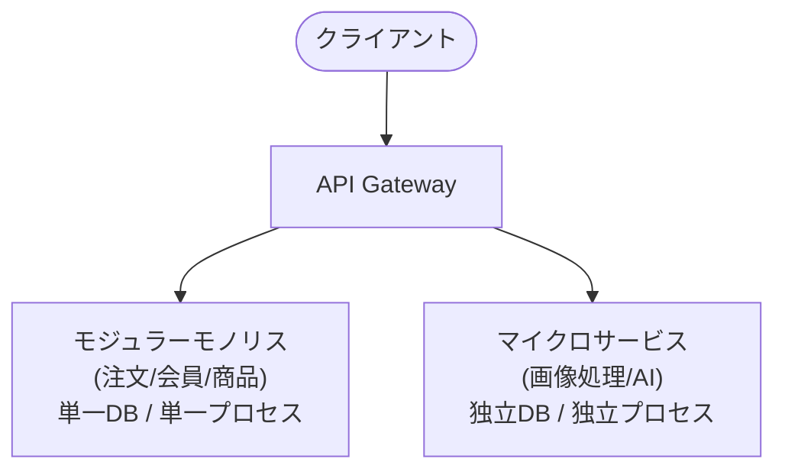

### メリット・デメリット

| 観点 | メリット | デメリット |
|---|---|---|
| **開発速度** | コアドメインはモノリス並みの速さで開発できる | 切り出したサービスのインターフェース設計に工数がかかる |
| **スケーリング** | 必要な部分だけ独立してスケールできる | モノリス部分は依然として全体スケールが必要 |
| **運用負荷** | 大部分は単一デプロイで管理が楽 | 切り出したサービス分、監視・ログ・トレースの基盤が必要 |
| **技術選択** | 特殊な領域だけ最適な言語・ライブラリを選べる | 技術スタックの碎片化が進み、社内の知見が分散する |
| **データ一貫性** | コアドメイン内はACIDトランザクションが使える | サービス間の整合性は最終一貫性に委ねる必要がある |

### 適用シーン

- 大半の業務ロジックはシンプルだが、**画像処理・動画変換・AI推論・レポート生成**など一部の処理だけが極端に重い
- チームの大半はモノリス開発に慣れているが、特定の専門チームだけがマイクロサービスを運用できる
- 初期はモジュラーモノリスで十分だが、将来の特定機能のスケールが見えている

### 実装のポイント

- **切り出し基準**: ビジネスロジックの複雑さではなく、リソース消費パターンや技術的特殊性で判断する
- **通信**: モジュラーモノリスから切り出しサービスへの呼び出しは非同期（メッセージキュー or イベントストリーミング）にし、結合度を下げる
- **データ所有権**: 切り出したサービスは自分のDBを持ち、モジュラーモノリスのDBを直接参照しない

---

## 2. モノリス + イベントストリーミング

### 構成の説明

アプリケーション本体はモノリスとして単一プロセスで動作し、外部システム連携やリアルタイム集計・監査ログのためだけにイベントストリーミング基盤（Kafka等）を導入する。アプリケーションはDB更新と同時にイベントを発行し、購読者が必要な処理を非同期で実行する。

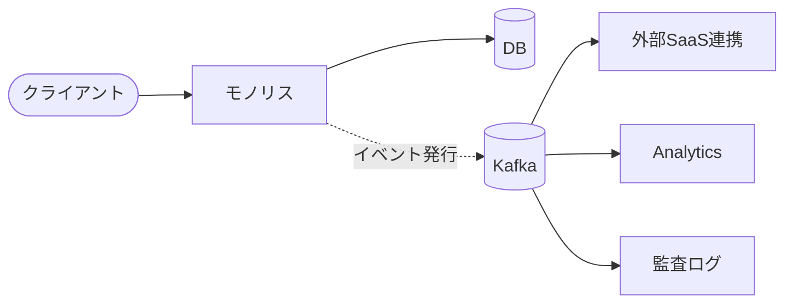

### メリット・デメリット

| 観点 | メリット | デメリット |
|---|---|---|
| **シンプルさ** | アプリ本体はモノリスのまま開発・デプロイが楽 | Kafka等のブローカーの運用・監視コストが追加される |
| **外部連携** | 外部SaaSの障害がアプリ本体に影響しにくい | 外部連携の結果をアプリにフィードバックするのが非同期になり設計が複雑 |
| **集計・分析** | リアルタイム集計や監査ログがイベント購読で実現できる | イベントスキーマの管理と互換性維持が必要 |
| **拡張性** | 新しい購読者を後から追加できる | イベント発行の失敗や順序の管理を自前で行う必要がある |

### 適用シーン

- リアルタイムダッシュボードや監査ログが必要だが、アプリケーション自体は複雑ではない
- 複数の外部SaaS（決済、メール、SMS）への連携が必要で、それらの障害を切り離したい
- 将来的な分析・ML用途のデータ収集を見越して、イベントログを蓄積したい

### 実装のポイント

- **アウトボックスパターン**: DB更新とイベント発行を同一トランザクションで担保し、ポーリングまたはCDC（Change Data Capture）でKafkaに配送する
- **イベントスキーマ**: イベントの内容を過度に正規化せず、購読者が独立して理解できる自己完結的なペイロードにする
- **冪等性**: 購読者側で冪等性を担保し、重複イベントの影響を排除する

---

## 3. マイクロサービス + モジュラーモノリス（ストラングラーフィグ）

### 構成の説明

既存のレガシーモノリスを段階的にマイクロサービス化する際、新機能はマイクロサービスとして独立させ、既存機能はモジュラーモノリス（またはそのままのモノリス）として残す。APIゲートウェイやファサードがリクエストを新旧に振り分ける。このパターンは**ストラングラーフィグ（Strangler Fig）パターン**と呼ばれる。

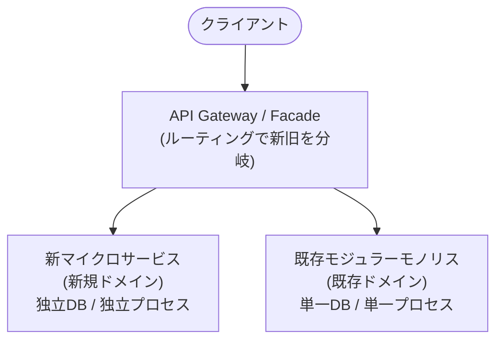

### メリット・デメリット

| 観点 | メリット | デメリット |
|---|---|---|
| **リスク管理** | 既存機能に影響を与えずに新機能をマイクロサービス化できる | 新旧のデータ整合性を保つための移行期間が長引くことがある |
| **段階的移行** | 一度に全面リライトするリスクを回避できる | 移行中は新旧の二重管理が必要になり工数が増える |
| **技術導入** | 新サービスだけ最新技術を試せる | 既存部分の技術的負債が解消されず長期化するリスク |
| **チーム編成** | 新機能開発チームと既存保守チームを分離しやすい | 新旧間の連携や知識伝達が不足すると開発速度が低下する |

### 適用シーン

- 大規模なレガシーモノリスがあり、全面リライトのリスクを避けたい
- 特定のドメイン（例: 決済、通知）だけを先にマイクロサービス化したい
- ビジネスの成長に伴い、特定機能の独立デプロイが必須になってきた

### 実装のポイント

- **データ同期**: 新旧間で必要なデータは、イベントストリーミングやAPI呼び出しで同期する。双方向のリアルタイム同期は複雑化するため、最終一貫性で十分な箇所が多い
- **ルーティング**: API Gatewayでのルーティングはシンプルに保ち、ドメイン単位で分岐させる（URLパスやサブドメイン）
- **段階的縮小**: 既存モジュールを1つずつ切り出し、完全に新サービスに置き換えてから次へ進む

---

## 4. BFF（Backend for Frontend）+ マイクロサービス

### 構成の説明

マイクロサービスの下位層は共通だが、Web、モバイル（iOS/Android）、パートナーAPI、管理画面などクライアントの種類に応じて**BFF（Backend for Frontend）**層を設ける。BFFは各クライアントに最適なAPI（REST/GraphQL）を提供し、下位のマイクロサービスをgRPC/RESTで呼び出して集約・変換する。

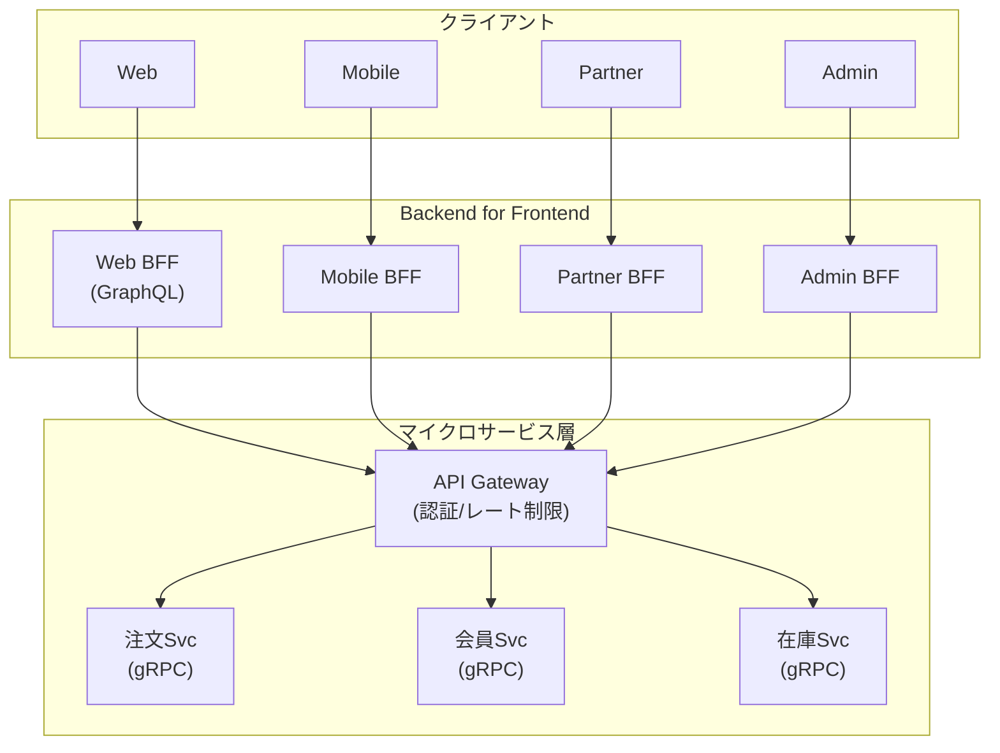

### メリット・デメリット

| 観点 | メリット | デメリット |
|---|---|---|
| **クライアント最適化** | Webはオーバーフェッチ防止、モバイルは帯域圧縮、それぞれに最適な応答が作れる | BFFの数だけデプロイ・監視対象が増える |
| **下位サービスの保護** | クライアント固有の要件をBFFで吸収し、下位サービスはシンプルに保てる | BFFと下位サービスの間でAPI変更の連携が必要 |
| **認可の分離** | Webユーザーと管理画面ユーザーの認可ロジックをBFFで分離できる | BFF層にビジネスロジックが滞留し、ファットBFFになるリスク |
| **チーム独立性** | クライアントチームがBFFを所有し、下位チームとの調整を減らせる | BFF間で重複実装が発生しやすい |

### 適用シーン

- 複数のクライアント（Web、ネイティブアプリ、パートナー、管理画面）が存在し、それぞれの要件が大きく異なる
- 下位のマイクロサービスは共通だが、UI/UXの最適化のために異なるデータ構造や集約が必要
- モバイルアプリのバージョン互換性を保ちながら、Webは最新のAPIに移行したい

### 実装のポイント

- **BFFの責務**: BFFは集約・変換・認可に留め、ビジネスルール自体は下位サービスに委ねる
- **GraphQL vs REST**: Web BFFにはGraphQLを使い、クライアント主導のデータ取得を実現する。モバイルやパートナーには帯域やキャッシュを重視してRESTを選ぶこともある
- **共通ライブラリ**: BFF間で重複しないよう、下位サービス呼び出しのクライアント生成や認証ミドルウェアを共通化する

---

## 5. CQRS + イベントソーシング

### 構成の説明

**CQRS（Command Query Responsibility Segregation）**は、データの更新（Command）と参照（Query）を別のモデル・DBに分離する。さらに**イベントソーシング**を組み合わせることで、状態そのものを保存するのではなく、状態変更を表すイベントのストリームを「ソース・オブ・トゥルース」として保存する。Query側はイベントを投影（Project）して読み取り用DBを構築する。

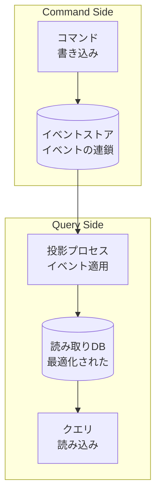

### メリット・デメリット

| 観点 | メリット | デメリット |
|---|---|---|
| **パフォーマンス** | 読み取りDBはクエリに最適化でき、書き込みはイベントストアに集中させられる | システム全体の複雑性が劇的に増す |
| **監査・履歴** | 全状態変更がイベントとして残るため、完全な監査証跡が得られる | イベントストアの容量が時間とともに膨大になる |
| **巻き戻し・再現** | 過去のイベントを再適用して任意の時点の状態を再現できる | イベントスキーマの変更（バージョニング）が非常に困難 |
| **スケーリング** | 読み取りと書き込みを独立してスケールできる | 最終一貫性のラグを考慮したUI設計が必要 |

### 適用シーン

- ドメインの状態変更履歴がビジネス上重要（金融取引、在庫変動、医療記録）
- 読み込みと書き込みのパターンが極端に異なり、単一DBでは両方を最適化できない
- 複数の読み取りモデル（集計、検索、レポート）が必要で、それぞれに最適なDBを使いたい

### 実装のポイント

- **イベント設計**: イベントは「何が起きたか（過去形）」を表現し、命令形を避ける。例: `OrderPlaced` ✓、`PlaceOrder` ✗
- **投影の冪等性**: 投影プロセスは冪等に実装し、同じイベントを何度適用しても結果が変わらないようにする
- **スナップショット**: イベント数が増えすぎないよう、一定件数ごとにスナップショットを取得し、再適用のコストを抑える
- **不是場合のフォールバック**: 全てのユースケースでCQRSを適用する必要はない。複雑な集計や監査が必要なドメインだけに適用し、シンプルなCRUDは従来の方式で良い

---

## パターン比較

| パターン | 核心の価値 | 主なトレードオフ | 導入の難易度 |
|---|---|---|---|
| **モジュラーモノリス + 一部マイクロサービス** | 大半のシンプルさを保ちつつ、特殊領域だけ最適化 | インターフェース設計と運用基盤の二重管理 | 中 |
| **モノリス + イベントストリーミング** | モノリスの開発速度 + 非同期連携の可用性 | ブローカー運用とイベントスキーマ管理の追加 | 低〜中 |
| **ストラングラーフィグ** | リスクを抑えた段階的なモノリス脱却 | 移行期間の新旧二重管理とデータ整合性 | 高 |
| **BFF + マイクロサービス** | クライアント最適化と下位サービスの保護 | BFFの増加による運用対象の増大と重複実装リスク | 中 |
| **CQRS + イベントソーシング** | 完全な監査証跡と読み書きの独立スケール | 圧倒的な実装・運用・設計の複雑性 | 非常に高い |

---

## 選定の指針

```
1. レガシーシステムの段階的刷新が必要か？
   ├─ Yes → ストラングラーフィグ
   └─ No  → 2へ

2. クライアントの種類が複数で、それぞれに最適なAPIが必要か？
   ├─ Yes → BFF + マイクロサービス
   └─ No  → 3へ

3. 状態変更の完全な履歴がビジネス要件か？
   ├─ Yes → CQRS + イベントソーシング
   └─ No  → 4へ

4. 高負荷/特殊処理が一部だけ存在するか？
   ├─ Yes → モジュラーモノリス + 一部マイクロサービス
   └─ No  → 5へ

5. 外部連携や集計の非同期化だけが必要か？
   ├─ Yes → モノリス + イベントストリーミング
   └─ No  → 純粋なモノリス or モジュラーモノリスで十分
```

---

## 補足: ハイブリッド構成の共通注意点

1. **データ所有権の明確化**: どのコンポーネントがどのデータをマスターとして持つかを明確に定義し、他コンポーネントは参照専用にする
2. **インターフェースの安定化**: コンポーネント間のAPI・イベントスキーマは、破壊的変更を避けるようバージョニングする
3. **Observabilityの統一**: 複数の構成要素が混在するため、分散トレーシング・ログ・メトリクスを統一基盤で収集する
4. **過度な複雑化の回避**: ハイブリッドは強みだが、すべてのパターンを同時に導入すると破綻する。現状の課題に最も適した1〜2パターンから始める

---

## 6. 個人開発におけるSSOとモジュラーモノリス

### 結論：個人開発ならモジュラーモノリスが最適

個人開発でSSO（OpenID Connect / OAuth 2.0）を構築する場合、**モジュラーモノリスを強く推奨する**。マイクロサービスやCQRS・イベントソーシングなどは過剰設計であり、学習コストと運用コストが成果を上回る。

### なぜモジュラーモノリスが適しているか

| 観点 | 理由 |
|---|---|
| **プロトコルの複雑性** | OIDCの認証コードフロー、PKCE、トークン発行・検証、リフレッシュ、セッション管理、同意画面など、**1リクエスト内で複数のモジュールが連携**する。同一プロセス内ならブレークポイントで追跡できる |
| **デバッグの容易さ** | 分散システムだとトレースIDの伝播やネットワーク障害の切り分けに時間がかかる。モジュラーモノリスならIDEのステップ実行で完結 |
| **DBのシンプルさ** | ユーザー、クライアント、認可コード、リフレッシュトークン、同意情報などを**単一DBのテーブルで管理**でき、トランザクションで整合性を担保できる |
| **モジュール境界の学習** | 認証、トークン発行、ユーザー管理、クライアント管理、同意管理といった**ドメイン境界を明示的に切る**練習になる。将来マイクロサービス化する際の設計力が身につく |
| **デプロイの容易さ** | 単一バイナリ・単一コンテナで動作し、個人のクラウド無料枠や自宅サーバーでも十分に運用できる |

### 推奨するモジュール構成

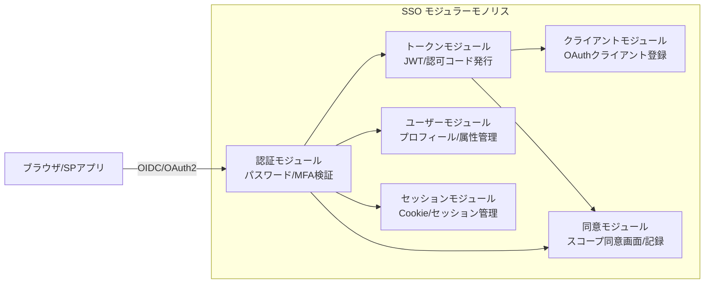

### やるべきこと

1. **モジュール間は公開API経由で通信する** — 同一プロセス内でも直接DBテーブルを跨いでSQLを書かず、モジュールの公開メソッド/リポジトリインターフェースを経由する
2. **単一DBを使う** — 認証、トークン、ユーザー情報は同一DBの異なるスキーマorテーブルセットに分離する。将来的に物理分割したくなった時点で移行すればよい
3. **インメモリイベントバスを使う** — 認証成功イベント → 監査ログ記録、同意更新イベント → キャッシュ無効化など、同一プロセス内の疎結合を体験できる
4. **インターフェースを定義してDIする** — トークンモジュールが「どのDBを使うか」を知らないように、リポジトリインターフェースを定義し実装を注入する

### やらない方がよいこと

| やらないこと | 理由 |
|---|---|
| マイクロサービス化 | ネットワーク通信、分散トレース、サービスディスカバリの学習コストがOIDCの学習を妨げる |
| CQRS + イベントソーシング | 認証イベントの巻き戻しが現実的に必要なシーンがほとんどない。圧倒的にオーバーエンジニアリング |
| 複数DB | 分散トランザクション（2PC or Saga）を管理する必要が出る。個人開発では破綻する |
| 独自プロトコル設計 | OIDC/OAuth 2.0は仕様が複雑だが、セキュリティコミュニティの知見が蓄積されている。独自設計は脆弱性を生む |

### 将来の移行パス

個人開発から実サービスへ成長した場合の移行イメージ：

```
Phase 1: モジュラーモノリス（現在）
    └─ 単一プロセス / 単一DB / モジュール境界あり

Phase 2: モジュラーモノリス + 一部マイクロサービス
    └─ 認証コアはモノリスのまま、FIDO/WebAuthnやプッシュ通知だけ外部化

Phase 3: マイクロサービス化 or IDaaS移行
    └─ Auth0/Okta/Keycloak等への移行を検討。自前で運用し続ける理由がなくなった時点
```

---

### 補足：個人開発でも各モジュールに独立DBを持つ価値

前述の「単一DB」を推奨したが、**各モジュール（認証・トークン・ユーザー・クライアント・同意）に独立したDBスキーマまたは物理DBを持つ設計でも問題ない**。

#### なぜ独立DBでも分散トランザクションが不要か

OIDCの認可コードフローでは、トランザクション的に整合性が必要な更新は**認可サービスのDB内だけで完結**する。

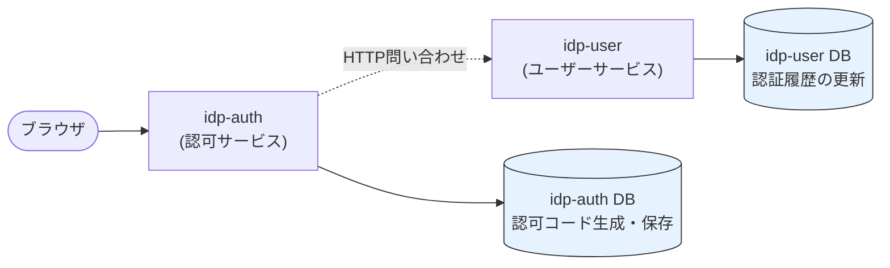

`idp-user` や `idp-client` への問い合わせは**参照系（読み取り）**であり、認可コードの発行・保存と同時に発生する更新ではない。したがって「複数DBを同一トランザクションで縛る」必要がない。

| サービス | 呼び出し方向 | 操作の性質 | トランザクション対象？ |
|---|---|---|---|
| `idp-auth` → `idp-user` | POST /auth/verify | パスワード検証（参照・問い合わせ） | **いいえ** |
| `idp-auth` → `idp-client` | GET /client/verify | client_id/secret 検証（参照） | **いいえ** |
| `idp-auth` 内部 | 認可コード生成・保存 | INSERT（更新） | **はい（自DB内のみ）** |
| `idp-user` 内部 | 認証履歴更新 | INSERT/UPDATE | 独立した副作用 |

`idp-user` の認証履歴更新が失敗しても、認可コードの発行には影響しない。これは**意図的な最終一貫性**であり、分散トランザクション（2PC/Saga）を導入する必要性がない。

#### 独立DBを持つことの本当の強み

個人開発で「同一DB」にしてしまうと、**結局SQLでJOINしてデータを取ってくればいい**とモジュール境界がすぐに崩れがち。各モジュールに独立DBを持つことで：

- `idp-auth` は `idp-user` のテーブルを知らない（パスワードハッシュ形式も知らない）
- `idp-user` は `idp-auth` の認可コードテーブルを知らない
- **物理的な分離が、論理的な分離を強制する**

これは学習目的として非常に価値が高く、後から実際のマイクロサービスに移行する際、DB分離の設計力がそのまま活きる。

#### 確認しておきたい 3 点

| # | 確認項目 | 理由 |
|---|---|---|
| 1 | **`idp-user` の認証APIは冪等？** | ネットワーク重試行で同じ認証リクエストが2回飛んでも、認証履歴が2重登録されないようにする |
| 2 | **`idp-auth` → `idp-client` 通信失敗時の挙動は？** | client_id検証で `idp-client` からエラーが返った場合、認可コードを発行しない処理フローが必要 |
| 3 | **各DBのマイグレーション管理方法は？** | `idp-auth/db/`、`idp-user/db/` のようにサービスごとに独立してスキーマ変更できるようにする |

---

## 7. 大規模IDaaS（Auth0 / Okta / Keycloak等）でのハイブリッド構成

大規模なIDaaS（Identity as a Service）の実装・運用現場でも、上記のハイブリッドパターンが実際に見られる。以下は現場で多い構成と、本書のパターンとの対応関係。

### 7-1. IdP Proxy（ストラングラーフィグ）— 最も多い

既存のActive DirectoryやGoogle Workspaceを認証情報のマスターとして維持し、前面に**OIDC/SAML提供層（IdP Proxy）**を構築する。これは「3. ストラングラーフィグ」に相当する。

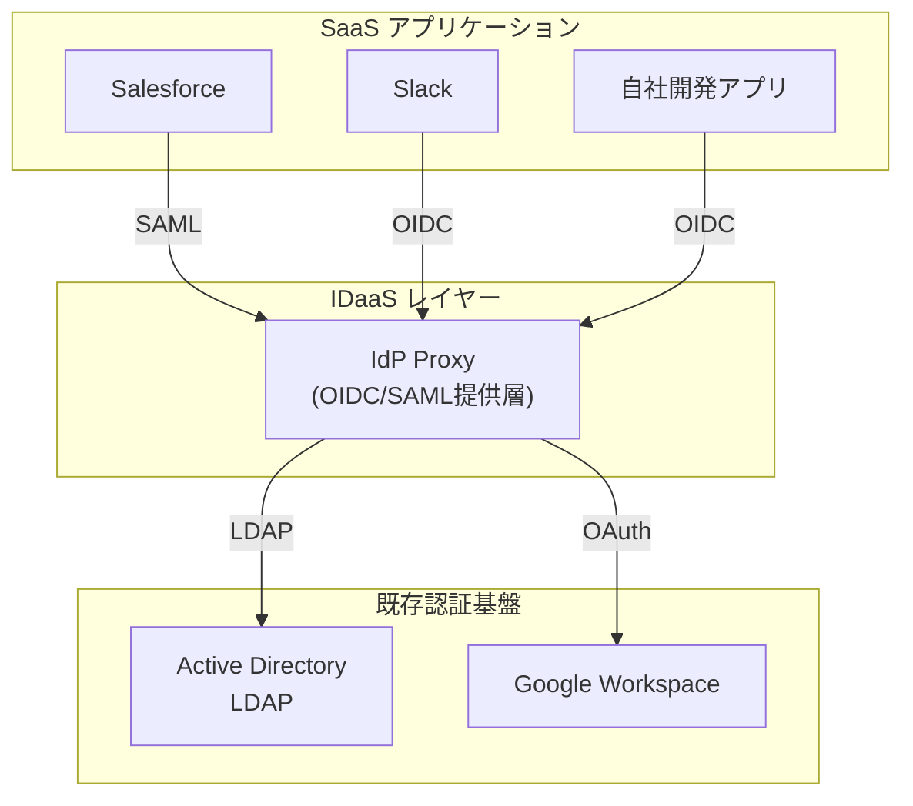

**なぜ多いか：**
- Active Directoryはファイルサーバー・グループポリシー等で必須であり全面置き換えが現実的でない
- 各SaaSがSAML/OIDCに対応しており、ADのLDAPをそのまま晒すわけにはいかない
- Microsoft Entra ID、Keycloak、Okta/Auth0はいずれもこの構成を公式にサポートしている

### 7-2. 認証モジュラーモノリス + イベント監査配信

Keycloak等の認証基盤をモジュラーモノリスとして運用し、**監査イベントの配信のみをKafka等で非同期化**する。これは「2. モノリス + イベントストリーミング」に相当する。

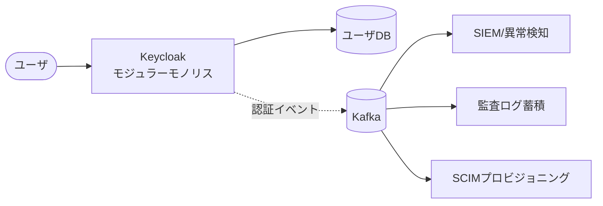

**なぜ多いか：**
- 「誰がいつログインしたか」はセキュリティ監査で必須だが、認証処理自体を遅くしたくない
- 失敗ログインの急増検知等は認証基盤とは別チーム・別システムで行いたい
- ユーザー属性変更を他SaaSや社内システムへ非同期連携（SCIMプロビジョニング）する需要が高い

### 7-3. BFF + マイクロサービス

SaaS型IDaaSの裏側では、クライアント種別（管理画面 / エンドユーザーログイン / パートナーAPI）に応じてBFF層を分け、下位は共通の認証マイクロサービス群とする。これは「4. BFF + マイクロサービス」に相当する。

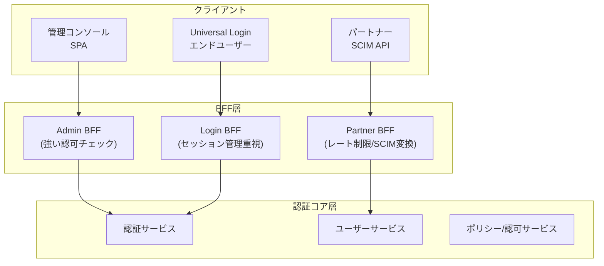

**なぜ多いか：**
- 管理者は「テナント内の全ユーザーを見る」、エンドユーザーは「自分だけ」という認可モデルが根本的に異なる
- SCIMプロビジョニングは通常のログインフローとは別プロトコルであり、専用BFFが必要
- エンドユーザー向けUniversal Loginはテナント毎にカスタマイズされるため、レンダリングBFFで吸収する

### 7-4. 認証コア + 特殊認証の切り出し

認証フロー本体はモジュラーモノリスとしてシンプルに保ち、FIDO/WebAuthnやプッシュ通知認証など**技術的特殊性の高い処理だけをマイクロサービス化**する。これは「1. モジュラーモノリス + 一部マイクロサービス」に相当する。

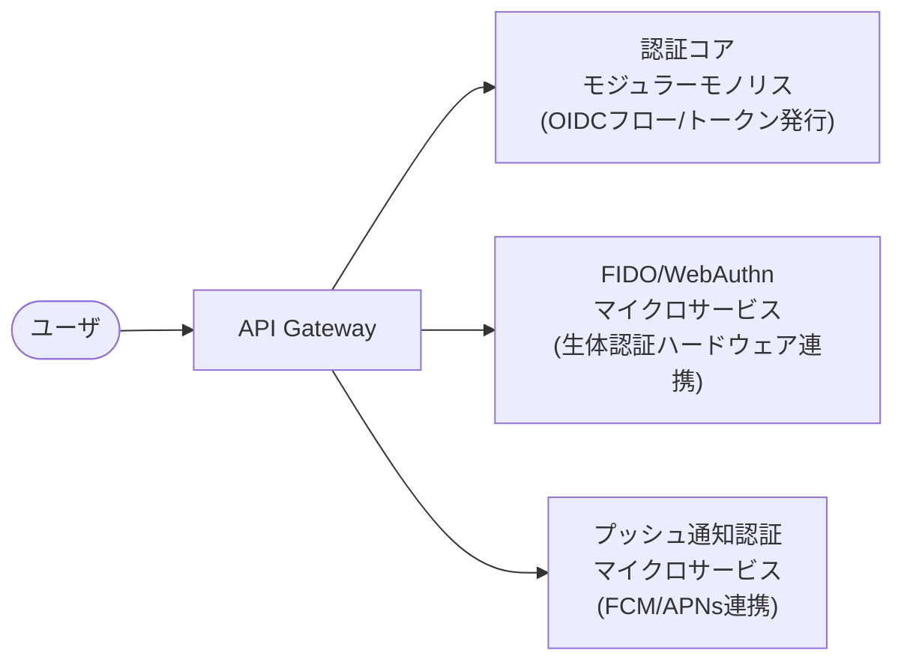

**なぜ多いか：**
- FIDO/WebAuthnのハードウェア連携や、FCM/APNsを使ったプッシュ通知はライブラリ・インフラの特殊性が高い
- 認証フロー自体はトランザクション的にシンプルに保ちたいが、これらの処理だけは独立したスケーリングや専門チームの管理が必要

### 7-5. CQRS + イベントソーシング（稀）

金融・医療・公共系等で「いつ・誰が・どのように認証したか」の**完全な監査証跡と時点再現**が要件となるケースでのみ採用される。これは「5. CQRS + イベントソーシング」に相当する。

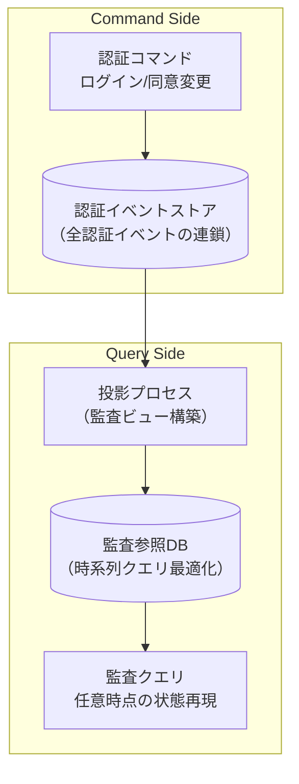

**注意：** 一般的な企業SSOでは**過剰設計**であり、ほとんどの場合「2. モノリス + イベントストリーミング」の監査ログ配信で十分。完全なイベントソーシングは、監査要件が法的に厳格な業界のみで採用される。

---

## 補足：個人開発者と大規模IDaaSの共通教訓

| # | 原則 | 理由 | 具体例 |
|---|---|---|---|
| 1 | **モジュール境界を先に定義する** | 後から分離するコストを下げる | 認証・トークン・ユーザー・クライアント・同意の責務を最初から決める |
| 2 | **DB分離は目的で選ぶ** | 同一DBでも構わないが、学習目的なら独立DBも有効 | 独立DBを使う場合、トランザクション的更新は単一DB内で完結させる |
| 3 | **物理的分離が論理的分離を強制する** | 「結局JOINすればいい」という妥協を防ぐ | `idp-auth` が `idp-user` のテーブルを知らない設計にする |
| 4 | **イベントは設計の一部** | 後付けだと負債になる | 監査ログはRedis Pub/Subで非同期化。Kafkaは個人開発では不要 |
| 5 | **仕様通り実装する** | 独自プロトコルは脆弱性を生む | OIDCの認証コードフロー・PKCE・JWT/JWKSを標準ライブラリで実装 |
| 6 | **分散トランザクションは避ける** | 2PC/Sagaは個人開発では破綻する | `idp-user` への呼び出しは参照系（問い合わせ）のみ。更新は `idp-auth` のDB内で完結 |
