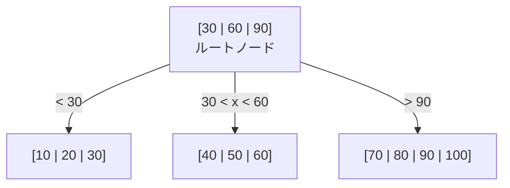

# インデックスの基礎とB-tree

## 目次

- [1. インデックスの本質と検討の観点](#1-インデックスの本質と検討の観点)
- [2. クエリとインデックスの関係](#2-クエリとインデックスの関係)
- [3. 単一インデックスで高速化する具体例](#3-単一インデックスで高速化する具体例)
  - [3.1 等値検索](#31-等値検索)
  - [3.2 ORDER BY + LIMIT（ソートの省略）](#32-order-by--limitソートの省略)
  - [3.3 MIN / MAX（テーブル全体の読み取り不要）](#33-min--maxテーブル全体の読み取り不要)
  - [3.4 JOIN での高速化](#34-join-での高速化)
- [4. B-tree と O(log N) の仕組み](#4-b-tree-と-olog-n-の仕組み)
- [5. 単一インデックスと複合インデックスの使い分け指針](#5-単一インデックスと複合インデックスの使い分け指針)

---

## 1. インデックスの本質と検討の観点

インデックスは**「テーブル（DB構造）の特定カラムに対して定義するが、目的は検索の高速化」**という関係です。

インデックスを検討する際、以下の3つの観点から考えます。

| 観点 | 具体例 |
|---|---|
| **カラムを抽出して、全探索より楽に探索できないか** | `WHERE user_id = ?` に対して `user_id` の単一インデックスや複合インデックスを検討 |
| **ソートして二分探索木にできないか** | `ORDER BY created_at`、`MIN(created_at)` に対して `created_at` の単一インデックスを検討（B-treeは常にソート済み） |
| **取りうる要素が絞られるものから検索できないか** | `WHERE user_id = ? AND status = ?` に対して `(user_id, status)` の複合インデックスを検討 |

---

## 2. クエリとインデックスの関係

1つのクエリに対して、**インデックスは0個、1個、または複数個**使われることがあります。

| パターン | 説明 |
|---|---|
| **1つのインデックス** | 最も一般的。`WHERE user_id = ?` に対して `user_id` のインデックスを使用 |
| **複合インデックス（1つで複数条件に対応）** | `INDEX(user_id, status)` が `WHERE user_id = ? AND status = ?` に対して効く |
| **複数のインデックス** | `INDEX(a)` と `INDEX(b)` を使い、結果をマージ（Index Merge）するケースもある |
| **インデックスを使わない** | フルスキャンの方が速いとオプティマイザが判断した場合 |

インデックスはテーブル（カラム）に対して定義し、クエリは実行時にそのインデックスを使うか使わないかをオプティマイザが判断します。

---

## 3. 単一インデックスで高速化する具体例

以下、`orders` テーブルを使った実例です。

```sql
CREATE TABLE orders (
  id          BIGINT PRIMARY KEY,
  user_id     BIGINT NOT NULL,
  status      VARCHAR(20) NOT NULL,
  amount      INT NOT NULL,
  created_at  DATETIME NOT NULL,
  INDEX idx_user_id (user_id),
  INDEX idx_status (status),
  INDEX idx_created_at (created_at)
);
```

### 3.1 等値検索

```sql
SELECT * FROM orders WHERE user_id = 42;
```

| 方式 | 動作 |
|---|---|
| **インデックスなし** | テーブル全行（例えば 100万行）をスキャンし、`user_id = 42` を探す |
| **インデックスあり** | `idx_user_id` から `42` の位置を特定し、該当行だけを読む |

対象が数件ならフルスキャンに比べて **100～1000倍速くなります**。

### 3.2 ORDER BY + LIMIT（ソートの省略）

```sql
SELECT * FROM orders ORDER BY created_at DESC LIMIT 10;
```

| 方式 | 動作 |
|---|---|
| **インデックスなし** | 100万行を一旦全件読み込み、`created_at` でソートしてから先頭10件を返す。メモリ不足時はディスクソートが発生 |
| **インデックスあり** | `idx_created_at` は既に `created_at` の順序で保持されている。末尾から10件だけ読めばよい |

**ソートコストがゼロ**になり、索引内だけで完結します。

### 3.3 MIN / MAX（テーブル全体の読み取り不要）

```sql
SELECT MIN(created_at) FROM orders;
```

| 方式 | 動作 |
|---|---|
| **インデックスなし** | テーブル全行を読んで最小値を探す |
| **インデックスあり** | `idx_created_at` の**先頭の1件**を読むだけで済む |

B-treeは`created_at`順に**常にソート済み**なので、最左端リーフの先頭エントリが最小値です。索引の先頭ポインタを見るだけで確定し、**極めて高速**です。

### 3.4 JOIN での高速化

```sql
SELECT o.*
FROM orders o
JOIN users u ON o.user_id = u.id
WHERE u.email = 'foo@example.com';
```

`users` テーブルから該当ユーザーを1件取得 → `orders` テーブルで `user_id` を探す、という流れになります。

| 方式 | 動作 |
|---|---|
| **インデックスなし** | `orders` テーブルを毎回フルスキャン。ユーザーごとに100万行スキャンが発生する |
| **インデックスあり** | `idx_user_id` から該当 `user_id` の行だけを取得 |

結合の内側ループが**フルスキャンから索引探索**に変わり、JOIN 全体が高速化します。

---

## 4. B-tree と O(log N) の仕組み

インデックスのほとんど（MySQLのInnoDB、PostgreSQLのB-treeなど）は**B-tree**と呼ばれる木構造でデータを保持しています。

### B-tree の構造

B-treeは**「枝分かれする辞書」**のようなものです。1つのノードに複数のキーを持ち、各キーは小さい値・大きい値の子ノードを持ちます。常にソート済みで保持されます。



### 2分探索木との関係

単一インデックスは、**そのカラムの値で2分探索的に飛べるようにする付加構造**です。厳密には「二分探索木の拡張版」であるB-treeを使います。

| 特性 | 2分探索木 | B-tree（DBのインデックス） |
|---|---|---|
| **各ノードのキー数** | 1個（子は最大2つ） | 複数個（子は最大「分岐数」個） |
| **探索の仕方** | 「大きい/小さい」で左右の子を選ぶ | 「どの区間に入るか」で子ノードを選ぶ |
| **本質** | 同じ：値の大小関係で木を降りて対象に到達する |

1カラムにインデックスを張る = **そのカラムの値をキーにしたB-treeを構築する**ことです。これにより以下が **O(log N)** で可能になります。

| 操作 | 2分探索的に何をしているか |
|---|---|
| `WHERE id = 42` | 42と比較しながら木を降りて、該当リーフへ |
| `WHERE id > 100` | 100の位置を特定し、そこから**右隣を順に走査** |
| `ORDER BY id LIMIT 10` | 最左端から10件順に読む |
| `MIN(id)` | 最左端リーフの先頭1件 |
| `MAX(id)` | 最右端リーフの末尾1件 |

### なぜ O(log N) なのか

`user_id = 42` を探す場合の流れ：

1. **ルートノード** `[30 | 60 | 90]` を読む → 42 は `30 < 42 < 60` なので真ん中の子ノードへ
2. **子ノード** `[40 | 50 | 60]` を読む → 42 は `40 < 42 < 50` なので真ん中の子ノード（またはリーフ）へ
3. **リーフノード** `[40 | 42 | 45]` を読む → 42 を発見 → 対応する行の場所（ポインタ）を取得

アクセス回数は「**木の高さ**」だけです。

| データ件数 (N) | 木の高さ | フルスキャン (N) | インデックス (log N) |
|---|---|---|---|
| 1,000 | 約2〜3 | 1,000回 | 2〜3回 |
| 1,000,000 | 約3〜4 | 1,000,000回 | 3〜4回 |
| 1,000,000,000 | 約4〜5 | 10億回 | 4〜5回 |

分岐数が多い（1ノードが数百キーを持つ）ため、**高さは驚くほど低く済みます**。

### フルスキャンとの比較

| 方式 | 仕組み | コスト |
|---|---|---|
| **フルスキャン** | 先頭から1行ずつ条件を確認 | **O(N)** → 100万件なら100万件チェック |
| **B-tree索引** | 木を降りて該当位置に直接ジャンプ | **O(log N)** → 100万件でも3〜4回のアクセス |

### なぜインデックスは常にソート済みなのか

B-treeは**挿入時に正しい位置に入れる**ことで、常にキー順を保ちます。日常のINSERT/UPDATEで「全件をソートし直す」処理は入りません。

| タイミング | 動作 |
|---|---|
| **インデックス作成時** | 初期構築で一時的にデータをソートしてからB-treeを組み立てることが多い（全件ランダム挿入よりページ利用率が良くなるため） |
| **日常のINSERT** | 該当リーフノードをO(log N)で探索し、空きがあればその位置に挿入。満杯ならページ分割を行うが、局所的な調整に留まる |
| **日常のUPDATE** | キー値が変わらなければ影響なし。変わる場合は「古いエントリを削除 → 新しい位置に挿入」の2ステップのみ |

この「常にソート済み」という性質のおかげで、`MIN()` は最左端リーフの先頭1件、`MAX()` は最右端リーフの末尾1件を見るだけで確定します。

---

## 5. 単一インデックスと複合インデックスの使い分け指針

| 状況 | 推奨 |
|---|---|
| 1カラムだけで絞り込み・ソートが完結する | **単一インデックス**で十分 |
| `WHERE a = ? AND b = ?` のように複数カラムを同時に絞る | **複合インデックス** (`a, b`) の方が効率的 |
| `WHERE a = ? ORDER BY b` | **複合インデックス** (`a, b`) でソートコストを消せる |

**結論**: 単一インデックスは「1つのカラムを条件・ソート・結合に使う」場合に非常に有効です。無理に複合インデックスにするより、まずはクエリのパターンに合わせて単一インデックスを検討する方がシンプルでメンテナンスコストも低くなります。
