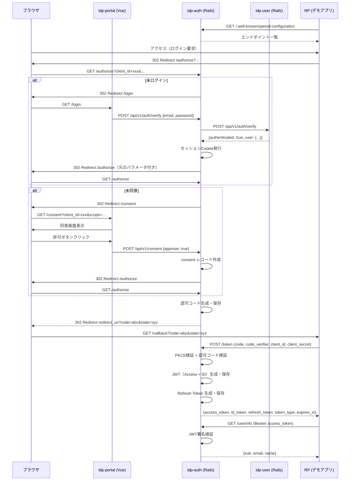

# SSO システム統合設計書

本ドキュメントは、OAuth 2.0 / OpenID Connect (OIDC) 準拠の自作 SSO 認証基盤の統合設計書です。
既存の要件定義・ドメイン設計・ディレクトリ構成案を統合し、開発開始に必要な設計判断を確定させたものです。

---

## 1. プロジェクト概要

| 項目 | 内容 |
|---|---|
| **目的** | OAuth 2.0 / OIDC プロトコルの理解を深めるため、シングルサインオン認証基盤を自作する |
| **システム構成** | マイクロサービス設計を前提とし、段階的にサービスを切り出す |
| **プロトコル** | OAuth 2.0 / OpenID Connect |
| **ユーザー規模** | 個人開発・学習レベル |
| **連携アプリ数（RP）** | 2〜3個（拡張可能） |

---

## 2. 技術スタック

| 層 | 技術 | 選定理由 |
|---|---|---|
| **言語** | Ruby | 要件定義に基づく |
| **フレームワーク** | Ruby on Rails（API + 管理画面API） | 開発速度と学習リソースの豊富さ |
| **フロントエンド** | Vue 3（Composition API） | すべての画面を SPA で統一 |
| **データベース** | PostgreSQL | 認可コード・トークン・ユーザー情報を永続化 |
| **ORM** | ActiveRecord | Rails 標準 |
| **認証ライブラリ** | 自作（JWT署名・検証、セッション管理） | 学習目的のため |
| **パスワードハッシュ** | bcrypt（cost 10以上） | セキュリティ要件 |
| **キャッシュ・Pub/Sub** | Redis | Phase 5 で監査ログの非同期連携に導入 |
| **コンテナ化** | Docker Compose | 環境統一と段階的なマイクロサービス化に対応 |
| **設定管理** | dotenv（開発）/ Rails Credentials（本番） | 12factor原則に準拠 |

---

## 3. アーキテクチャ設計

### 3.1 基本方針

マイクロサービス設計（ドメイン境界ベース）を最終形とし、以下の方針で段階的に進化させる。

| フェーズ | 構成 | 特徴 |
|---|---|---|
| **Phase 1** | モノレポ内モジュール分割 | `idp-auth`, `idp-user`, `idp-client` を同一 Rails アプリ内で名前空間（モジュール）として分離。DB は PostgreSQL のスキーマまたは個別 DB で論理的に分離し、将来の切り出しを見越す |
| **Phase 2** | `idp-auth` 切り出し | 認可サービスを独立した Rails アプリとして分離。`idp-user` との通信を内部 HTTP API 化 |
| **Phase 3** | `idp-client` 切り出し | クライアント管理サービスを分離。`idp-auth` から内部 API で呼び出し |
| **Phase 4** | フロントエンド分離 + API Gateway | `idp-portal`（一般ユーザー）と `idp-admin-ui`（管理者）を独立 SPA として運用。nginx でルーティング統合 |
| **Phase 5** | イベント駆動 + 監査ログ | `idp-audit` を新設。Redis Pub/Sub で非同期イベント連携を導入 |

### 3.2 ドメイン境界

| ドメイン | 責務 | 担当サービス |
|---|---|---|
| **認可（Authorization）** | 認可コード・トークンの発行・検証・失効 | `idp-auth` |
| **ユーザー（User/Identity）** | アカウント管理・パスワード検証 | `idp-user` |
| **クライアント（Client/RP）** | 連携アプリの登録・管理 | `idp-client` |
| **同意（Consent）** | ユーザー同意の管理 | `idp-auth` 内（個人開発レベルでは統合） |
| **監査（Audit）** | 操作履歴の記録 | `idp-audit`（Phase 5 で新設） |

### 3.3 サービス連携パターン

```
┌─────────────┐      ┌──────────────────────────────────────────────────────────┐
│   RP        │      │  モノレポ（Phase 1） / マイクロサービス群（Phase 2〜）    │
│ (クライアント) │─────▶│                                                          │
└─────────────┘      │  ┌──────────┐    ┌──────────┐    ┌──────────┐            │
                     │  │ idp-auth │◄───│ idp-user │    │idp-client│            │
                     │  │ (認可)   │HTTP│ (認証)   │    │(RP管理)  │            │
                     │  └────┬─────┘    └──────────┘    └──────────┘            │
                     │       │                                                   │
                     │  ┌────┴─────┐    ┌──────────┐                            │
                     │  │ PostgreSQL│    │  Redis   │（Phase 5で監査連携）      │
                     │  │(認可コード,│    │(Pub/Sub) │                            │
                     │  │ トークン) │    └──────────┘                            │
                     │  └──────────┘                                              │
                     │                                                            │
                     │  ┌──────────────┐    ┌──────────────┐                     │
                     │  │ idp-portal   │    │ idp-admin-ui │                     │
                     │  │(Vue SPA)     │    │(Vue SPA)     │                     │
                     │  └──────────────┘    └──────────────┘                     │
                     └──────────────────────────────────────────────────────────┘
```

#### 同期通信（REST API）

| 呼び出し元 | 呼び出し先 | 用途 |
|---|---|---|
| `idp-auth` | `idp-user` | ユーザー認証問い合わせ（メール・パスワード検証） |
| `idp-auth` | `idp-client` | client_id / client_secret 検証、リダイレクトURI確認 |
| `idp-portal` | `idp-auth` | 認可エンドポイント呼び出し、ログイン画面連携 |
| `idp-admin-ui` | `idp-auth` | トークン発行状況確認、管理操作 |

#### 非同期通信（Redis Pub/Sub）— Phase 5

| 発行サービス | イベント名 | 購読サービス | 用途 |
|---|---|---|---|
| `idp-auth` | `token.issued` | `idp-audit` | トークン発行ログ記録 |
| `idp-auth` | `token.revoked` | `idp-audit` | トークン失効ログ記録 |
| `idp-user` | `user.login` | `idp-audit` | ログイン履歴記録 |
| `idp-user` | `user.created` | `idp-audit` | ユーザー登録ログ記録 |

---

## 4. ディレクトリ構成（Phase 1：モノレポ統合型）

マイクロサービス設計を前提としつつ、Phase 1 はモノレポで論理的分離を行う。

```
my-sso/
├── AGENTS.md
├── README.md
├── project/
│   ├── requirements.md
│   └── design.md              # 本ファイル
├── architecture/              # アーキテクチャ検討資料（過去ドキュメント）
├── guides/
│   └── relying-party-usage.md # RP連携ガイド
├── dev-tools/
│   ├── tools.md               # 開発ツール選定
│   └── ai-agent-tools.md      # AIエージェント支援定義
│
├── docker-compose.yml         # PostgreSQL + Rails + Vue 一括起動
├── .env.example
│
├── backend/                   # Ruby on Rails（IdP 本体）
│   ├── Gemfile
│   ├── Gemfile.lock
│   ├── Rakefile
│   ├── config.ru
│   ├── app/
│   │   ├── controllers/
│   │   │   ├── api/
│   │   │   │   ├── v1/
│   │   │   │   │   ├── auth/
│   │   │   │   │   │   ├── authorize_controller.rb   # GET  /authorize
│   │   │   │   │   │   ├── token_controller.rb        # POST /token
│   │   │   │   │   │   ├── revoke_controller.rb       # POST /revoke
│   │   │   │   │   │   └── userinfo_controller.rb     # GET  /userinfo
│   │   │   │   │   ├── users_controller.rb            # ユーザー管理API
│   │   │   │   │   ├── clients_controller.rb          # RP登録管理API
│   │   │   │   │   └── admin/
│   │   │   │   │       ├── dashboard_controller.rb    # 管理画面用API
│   │   │   │   │       ├── users_controller.rb        # ユーザー一覧・詳細
│   │   │   │   │       └── clients_controller.rb      # クライアント一覧・詳細
│   │   │   │   └── well_known_controller.rb           # GET /.well-known/openid-configuration
│   │   │   └── application_controller.rb
│   │   │
│   │   ├── models/
│   │   │   ├── user.rb                  # ユーザーアカウント
│   │   │   ├── client.rb                # RP登録情報
│   │   │   ├── authorization_code.rb    # 認可コード（短期間有効）
│   │   │   ├── access_token.rb          # アクセストークン（JWT、15分）
│   │   │   ├── refresh_token.rb         # リフレッシュトークン（ランダム文字列、7日）
│   │   │   └── consent.rb               # 同意履歴
│   │   │
│   │   ├── services/
│   │   │   ├── auth/
│   │   │   │   ├── authorization_code_service.rb  # 認可コード発行・検証
│   │   │   │   ├── token_service.rb               # JWT発行・検証（RS256）
│   │   │   │   ├── pkce_service.rb                # PKCE検証
│   │   │   │   └── session_service.rb             # セッション管理
│   │   │   ├── user/
│   │   │   │   ├── password_service.rb            # bcryptハッシュ化・検証
│   │   │   │   └── authentication_service.rb      # 認証フロードライバ
│   │   │   └── client/
│   │   │       └── client_verification_service.rb # client_id/secret検証
│   │   │
│   │   └── views/                       # Phase 1では不使用（APIモード）
│   │
│   ├── config/
│   │   ├── routes.rb
│   │   ├── database.yml                 # PostgreSQL接続設定（マルチDB/スキーマ対応）
│   │   └── initializers/
│   │
│   ├── db/
│   │   ├── migrate/
│   │   │   ├── 001_create_users.rb
│   │   │   ├── 002_create_clients.rb
│   │   │   ├── 003_create_authorization_codes.rb
│   │   │   ├── 004_create_access_tokens.rb
│   │   │   ├── 005_create_refresh_tokens.rb
│   │   │   └── 006_create_consents.rb
│   │   └── seeds.rb
│   │
│   ├── lib/
│   │   └── oidc/
│   │       ├── discovery.rb             # OIDC Discoveryメタデータ
│   │       ├── grant_types.rb           # サポートするgrant_type一覧
│   │       ├── scopes.rb                # openid, profile, email
│   │       └── jwt_signer.rb            # RS256署名・検証ロジック
│   │
│   ├── spec/                            # RSpec + FactoryBot
│   │   ├── models/
│   │   ├── services/
│   │   ├── requests/
│   │   └── support/
│   │       └── factories/
│   │
│   └── Dockerfile
│
├── frontend/                            # Vue 3 SPA（統合フロントエンド）
│   ├── package.json
│   ├── vite.config.ts
│   ├── index.html
│   ├── src/
│   │   ├── main.ts
│   │   ├── App.vue
│   │   ├── router/
│   │   │   └── index.ts                 # /login, /consent, /admin/*
│   │   ├── views/
│   │   │   ├── LoginView.vue            # エンドユーザーログイン画面
│   │   │   ├── ConsentView.vue          # 同意画面
│   │   │   └── admin/
│   │   │       ├── DashboardView.vue    # 管理者ダッシュボード
│   │   │       ├── UsersView.vue        # ユーザー管理
│   │   │       └── ClientsView.vue      # RPクライアント管理
│   │   ├── components/
│   │   ├── stores/                      # Pinia
│   │   │   ├── auth.ts                  # 認証状態管理
│   │   │   └── admin.ts                 # 管理画面状態
│   │   ├── api/                         # Rails API クライアント
│   │   │   ├── auth.ts                  # /authorize, /token, /userinfo
│   │   │   ├── admin.ts                 # 管理画面API
│   │   │   └── client.ts                # RP管理API
│   │   └── composables/
│   │       └── useOAuth.ts              # PKCE生成・Discovery取得
│   ├── public/
│   └── Dockerfile
│
├── demo-rp/                             # デモ用 Relying Party
│   ├── package.json
│   ├── vite.config.ts
│   ├── src/
│   │   ├── main.ts
│   │   ├── App.vue
│   │   └── oauth2/
│   │       ├── authorize.ts             # Discovery + PKCE + /authorize リダイレクト
│   │       ├── callback.ts              # /callback?code=xxx 処理
│   │       └── userinfo.ts              # /userinfo 取得
│   ├── .env.example
│   └── Dockerfile
│
└── infrastructure/                      # 共有インフラ（Phase 2〜で拡張）
    ├── nginx/
    │   └── nginx.conf                   # Phase 4 で API Gateway として導入
    ├── postgresql/
    │   └── init/
    │       └── 01_init.sql              # DB/スキーマ初期化
    └── redis/
        └── redis.conf                   # Phase 5 で導入
```

---

## 5. データベース設計

### 5.1 テーブル一覧

| テーブル名 | 保存先 | 用途 | 有効期限 |
|---|---|---|---|
| `users` | PostgreSQL（user_db / userスキーマ） | ユーザーアカウント | 永続 |
| `clients` | PostgreSQL（client_db / clientスキーマ） | RP登録情報 | 永続 |
| `authorization_codes` | PostgreSQL（auth_db / authスキーマ） | 認可コード | 10分 |
| `access_tokens` | PostgreSQL（auth_db / authスキーマ） | アクセストークン（JWT本体は別途署名） | 15分 |
| `refresh_tokens` | PostgreSQL（auth_db / authスキーマ） | リフレッシュトークン | 7日 |
| `consents` | PostgreSQL（auth_db / authスキーマ） | ユーザー同意履歴 | 永続 |

> **選定理由**: Phase 1 では短命データ（認可コード）も PostgreSQL で管理する。ステートレス化・キャッシュの学習は Phase 3〜5 で段階的に Redis に移行する。

### 5.2 スキーマ定義

#### `users`（ユーザーアカウント）

| カラム | 型 | 制約 | 説明 |
|---|---|---|---|
| `id` | UUID | PK | ユーザーID |
| `email` | string | NOT NULL, UNIQUE | ログインID（メールアドレス） |
| `password_hash` | string | NOT NULL | bcryptハッシュ |
| `name` | string | NOT NULL | 表示名 |
| `created_at` | datetime | | 作成日時 |
| `updated_at` | datetime | | 更新日時 |
| `last_login_at` | datetime | NULLABLE | 最終ログイン日時 |

#### `clients`（RP登録情報）

| カラム | 型 | 制約 | 説明 |
|---|---|---|---|
| `id` | UUID | PK | クライアントID（公開） |
| `client_id` | string | NOT NULL, UNIQUE | RP識別子 |
| `client_secret` | string | NOT NULL | クライアントシークレット（ハッシュ化推奨） |
| `name` | string | NOT NULL | アプリ名称 |
| `redirect_uris` | text[] | NOT NULL | 許可リダイレクトURI一覧 |
| `allowed_scopes` | string[] | NOT NULL, DEFAULT '{openid}' | 許可スコープ |
| `created_at` | datetime | | 作成日時 |
| `updated_at` | datetime | | 更新日時 |

#### `authorization_codes`（認可コード）

| カラム | 型 | 制約 | 説明 |
|---|---|---|---|
| `id` | UUID | PK | |
| `code` | string | NOT NULL, UNIQUE | 認可コード文字列（ランダム256bit, Base64URL） |
| `user_id` | UUID | NOT NULL, FK(users) | 認証済みユーザー |
| `client_id` | string | NOT NULL | RP識別子 |
| `redirect_uri` | string | NOT NULL | 当時指定されたリダイレクトURI |
| `scope` | string | NOT NULL | 許可されたスコープ（スペース区切り） |
| `code_challenge` | string | NULLABLE | PKCE code_challenge |
| `code_challenge_method` | string | NULLABLE | 'S256' |
| `expires_at` | datetime | NOT NULL | 有効期限（10分後） |
| `used_at` | datetime | NULLABLE | 使用日時（1回限り使用） |
| `created_at` | datetime | | 作成日時 |

#### `access_tokens`（アクセストークン）

| カラム | 型 | 制約 | 説明 |
|---|---|---|---|
| `id` | UUID | PK | |
| `token` | string | NOT NULL, UNIQUE | JWT文字列（RS256署名） |
| `user_id` | UUID | NOT NULL, FK(users) | |
| `client_id` | string | NOT NULL | |
| `scope` | string | NOT NULL | |
| `expires_at` | datetime | NOT NULL | 有効期限（15分後） |
| `revoked_at` | datetime | NULLABLE | 失効日時 |
| `created_at` | datetime | | |

> JWT本体にユーザー情報を含むため、DBには署名済みトークン文字列とメタデータを保存する。

#### `refresh_tokens`（リフレッシュトークン）

| カラム | 型 | 制約 | 説明 |
|---|---|---|---|
| `id` | UUID | PK | |
| `token` | string | NOT NULL, UNIQUE | ランダム文字列（256bit, Base64URL） |
| `user_id` | UUID | NOT NULL, FK(users) | |
| `client_id` | string | NOT NULL | |
| `scope` | string | NOT NULL | |
| `expires_at` | datetime | NOT NULL | 有効期限（7日後） |
| `revoked_at` | datetime | NULLABLE | 失効日時 |
| `created_at` | datetime | | |

#### `consents`（同意履歴）

| カラム | 型 | 制約 | 説明 |
|---|---|---|---|
| `id` | UUID | PK | |
| `user_id` | UUID | NOT NULL, FK(users) | |
| `client_id` | string | NOT NULL | |
| `scope` | string | NOT NULL | 同意されたスコープ |
| `created_at` | datetime | | |
| `updated_at` | datetime | | |

| ユニーク制約 | (`user_id`, `client_id`) |

---

## 6. API 設計

### 6.1 OIDC 公開エンドポイント

| メソッド | パス | 説明 | 認証 |
|---|---|---|---|
| `GET` | `/.well-known/openid-configuration` | Discovery | 不要 |
| `GET` | `/jwks.json` | 公開鍵配布（JWKS） | 不要 |
| `GET` | `/authorize` | 認可コード発行（ログイン・同意） | Cookieセッション |
| `POST` | `/token` | トークン発行・更新 | client認証 |
| `GET` | `/userinfo` | ユーザー情報取得 | Access Token |
| `POST` | `/revoke` | トークン失効 | client認証 |

### 6.2 内部管理 API

| メソッド | パス | 説明 | 認証 |
|---|---|---|---|
| `POST` | `/api/v1/admin/users` | ユーザー登録 | Admin Token |
| `GET` | `/api/v1/admin/users` | ユーザー一覧 | Admin Token |
| `POST` | `/api/v1/admin/clients` | RPクライアント登録 | Admin Token |
| `GET` | `/api/v1/admin/clients` | RPクライアント一覧 | Admin Token |

### 6.3 内部サービス連携 API（idp-auth → idp-user）

| メソッド | パス | 説明 | 呼び出し元 |
|---|---|---|---|
| `POST` | `/api/v1/auth/verify` | メール・パスワード検証 | `idp-auth` |
| `GET` | `/api/v1/users/:id` | ユーザー情報取得 | `idp-auth` |

> 内部APIは `X-Internal-API-Key` ヘッダーで認証し、インターネット公開しない。

---

## 7. 認証フロー設計

### 7.1 Authorization Code Flow with PKCE



### 7.2 セッション管理

| 項目 | 設計 |
|---|---|
| **方式** | Rails セッションCookie（`session_store :cookie_store`） |
| **Cookie属性** | `HttpOnly`, `Secure`（開発環境では自己署名証明書可）, `SameSite=Lax` |
| **有効期限** | ブラウザセッション（ログイン画面で「ログイン状態を保持」チェックで延長可能） |
| **保存データ** | `user_id` のみ（最小限） |

> **選定理由**: Phase 1〜2では Redis 導入を最小化し、Rails標準Cookieでシンプルに実装。Phase 4以降でスケーリング要件が出た場合に Redis セッションストアへ移行。

---

## 8. セキュリティ設計

### 8.1 セキュリティ要件対応表

| 要件 | 対応策 | 実装箇所 |
|---|---|---|
| **PKCE** | `code_challenge_method=S256` を必須化 | `PkceService` |
| **HTTPS** | 開発環境では自己署名証明書。本番は Let's Encrypt 等 | `config/environments/production.rb`, nginx |
| **パスワードストレッチング** | bcrypt cost 10以上 | `PasswordService` |
| **XSS対策** | CSP ヘッダー設定, Vueのエスケープ機構 | `application_controller.rb`, nginx |
| **CSRF対策** | SameSite Cookie, `state` パラメータ検証 | Cookie設定, `authorize_controller.rb` |
| **トークン有効期限** | Access=15分, Refresh=7日, Code=10分 | 各モデルの `expires_at` |
| **JWT署名** | RS256（非対称鍵）。公開鍵は `/jwks.json` で配布 | `JwtSigner`, `WellKnownController` |
| **内部API保護** | `X-Internal-API-Key` ヘッダー認証 | 各内部APIコントローラの `before_action` |

### 8.2 JWT・鍵管理

| 項目 | 設計 |
|---|---|
| **署名アルゴリズム** | RS256 |
| **鍵ペア** | 2048bit RSA |
| **保存先** | `config/jwks/`（開発）/ Rails Credentials（本番） |
| **鍵ローテーション** | 複数鍵を JWKS で公開。新規発行は新鍵、検証は全公開鍵で実施 |
| **ID Tokenクレーム** | `iss`, `sub`, `aud`, `exp`, `iat`, `nonce`（authorize時指定の場合） |

---

## 9. フロントエンド設計

### 9.1 画面一覧

| 画面 | パス | 用途 | 認証要否 |
|---|---|---|---|
| ログイン画面 | `/login` | メール・パスワード入力 | 不要 |
| 同意画面 | `/consent` | RPへのスコープ許可 | 要セッション |
| 管理ダッシュボード | `/admin` | システム概要 | Admin要 |
| ユーザー管理 | `/admin/users` | 登録ユーザー閲覧 | Admin要 |
| RPクライアント管理 | `/admin/clients` | 連携アプリ登録・閲覧 | Admin要 |

### 9.2 Vue アプリケーション構成

| アプリ | 用途 | ビルド先 |
|---|---|---|
| `idp-portal` | 一般ユーザー向け（ログイン・同意） | `backend/public/portal/` or 別ポート配信 |
| `idp-admin-ui` | 管理者向け | `backend/public/admin/` or 別ポート配信 |

> Phase 1 では `frontend/` 内に両方の SPA をビルドし、Rails の `public/` 配下に配置するか、Vite 開発サーバで別ポート起動する。

---

## 10. 開発フェーズ詳細

### Phase 1: 基盤構築（DB設計・ユーザー登録・ログイン）

- [ ] Docker Compose 環境構築（Rails + PostgreSQL）
- [ ] マルチDB/スキーマ設定（認可DB・ユーザーDB・クライアントDBの論理分離）
- [ ] マイグレーション作成（users, clients, authorization_codes, access_tokens, refresh_tokens, consents）
- [ ] `idp-user` モジュール実装（サインアップ、ログイン、パスワードハッシュ化）
- [ ] `idp-auth` モジュール実装（セッションCookie発行、ログイン状態保持）
- [ ] `idp-client` モジュール実装（RPクライアント登録API）
- [ ] Vue ログイン画面実装
- [ ] RSpec + FactoryBot セットアップ + モデルテスト

### Phase 2: OAuth2/OIDC エンドポイント実装

- [ ] `/.well-known/openid-configuration` 実装
- [ ] `/authorize` エンドポイント実装（認可コード発行）
- [ ] `/token` エンドポイント実装（Authorization Code Exchange）
- [ ] Vue 同意画面実装
- [ ] `idp-auth` の独立アプリ化（モノレポ内から切り出し）
- [ ] `idp-auth` ↔ `idp-user` 内部HTTP連携

### Phase 3: JWT発行・検証・UserInfo

- [ ] RS256 鍵ペア生成・管理機構
- [ ] JWT Access Token / ID Token 発行
- [ ] `/jwks.json` 公開鍵配布
- [ ] `/userinfo` エンドポイント実装
- [ ] `/revoke` エンドポイント実装
- [ ] JWT署名・検証の単体テスト（徹底）

### Phase 4: デモRP・フロントエンド整備

- [ ] デモRPアプリ実装（Vue SPA）
- [ ] PKCEフローの E2E テスト（Playwright）
- [ ] 管理画面 Vue SPA 実装（ユーザー・クライアント閲覧）
- [ ] nginx API Gateway 導入
- [ ] CORS設定・リバースプロキシ設定

### Phase 5: セキュリティ強化・監査ログ

- [ ] PKCE強制化（public clientでは必須）
- [ ] CSP ヘッダー設定
- [ ] Redis 導入（Pub/Sub）
- [ ] `idp-audit` サービス新設（イベント購読）
- [ ] 監査ログ出力（token.issued, token.revoked, user.login, user.created）
- [ ] Brakeman + bundler-audit セキュリティスキャン導入
- [ ] GitHub Actions CI/CD 構築

---

## 11. ツール・CI/CD ロードマップ

| フェーズ | 導入ツール |
|---|---|
| **Phase 1（今すぐ）** | lefthook, RuboCop, ESLint + Prettier, RSpec + FactoryBot, strong_migrations, dotenv, Docker Compose |
| **Phase 2（本格化時）** | GitHub Actions, Brakeman + bundler-audit, Swagger UI, Playwright |
| **Phase 3（リリース前）** | OWASP ZAP, Dependabot, Rails Credentials, VitePress |

---

## 12. 制約と前提条件

1. **学習目的**: 本システムは教育用であり、機密データの取り扱いは推奨しない
2. **単一プロセス**: Phase 1〜2 は単一プロセス・単一DBインスタンスでの動作を想定
3. **HTTPS（開発）**: 自己署名証明書を使用可能
4. **分散トランザクション**: Phase 1〜4 は分散トランザクション機構を導入しない。`idp-auth` が `idp-user` を同期的に呼び出し、認可コード発行は単一DBで完結させる（詳細は `architecture/06-distributed-transaction-design.md` 参照）
5. **MFA・SAML・ソーシャルログイン**: 対象外（将来の拡張）

---

## 13. 関連ドキュメント

- `project/requirements.md` — 要件定義書
- `architecture/01-prerequisites-idp-auth-and-user.md` — idp-auth と idp-user の前提知識
- `architecture/02-domain-boundary-design.md` — ドメイン境界設計
- `architecture/03-directory-structure-monolithic.md` — モノレポ構成案
- `architecture/04-directory-structure-microservices.md` — マイクロサービス構成案
- `architecture/05-microservices-tradeoffs.md` — マイクロサービス切り分けのトレードオフ
- `architecture/06-distributed-transaction-design.md` — 分散トランザクション設計メモ
- `guides/relying-party-usage.md` — RP（Relying Party）利用ガイド
- `dev-tools/tools.md` — 開発環境整備ツール一覧
- `dev-tools/ai-agent-tools.md` — AIエージェントツール一覧
